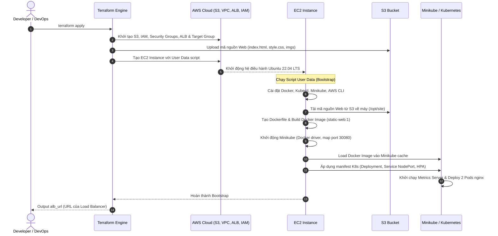
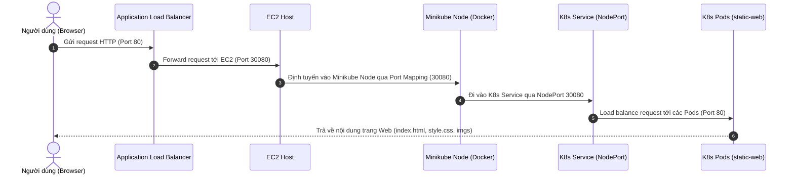

# K8s on AWS — Terraform 1-Click (EC2 + Minikube + ALB)

Mục tiêu: 1 lệnh Terraform sẽ dựng **1 EC2**, bật **minikube** trong EC2, deploy **app tĩnh** (dùng `index.html/style.css/imgs` trong repo), và **expose ra AWS ALB**.

## Yêu cầu
- AWS credentials đã cấu hình (ví dụ: `AWS_ACCESS_KEY_ID`, `AWS_SECRET_ACCESS_KEY`, hoặc AWS profile)
- Terraform `>= 1.5`

## Chạy (1-click)
```bash
terraform init
terraform apply -auto-approve
```

Terraform sẽ output:
- `alb_url`: URL public của ALB (mở trên browser)

## Dọn hạ tầng
```bash
terraform destroy -auto-approve
```

## Kiến trúc hệ thống (System Architecture)

Dưới đây là sơ đồ kiến trúc tổng thể của hệ thống, thể hiện cách luồng traffic của người dùng được định tuyến từ internet qua Load Balancer (ALB) vào trong cụm Kubernetes (Minikube) chạy trên EC2:

```mermaid
graph TD
    User([Người dùng / Internet]) -- "HTTP (Port 80)" --> ALB[AWS ALB]
    
    subgraph VPC [AWS Default VPC]
        ALB -- "Forward (Port 30080)" --> SG_EC2[Security Group EC2<br/>Chỉ mở Port 30080 từ ALB SG]
        
        subgraph EC2_Instance [AWS EC2 Instance]
            SG_EC2 --> Docker[Docker Engine]
            
            subgraph Minikube_Container [Minikube Container - Docker Driver]
                direction TB
                subgraph K8s_Cluster [Kubernetes Cluster]
                    K8s_SVC[K8s Service: static-web<br/>Type: NodePort 30080]
                    K8s_Deployment[K8s Deployment: static-web<br/>Replicas: 2-5]
                    HPA[Horizontal Pod Autoscaler<br/>CPU Target: 50%]
                    MetricsServer[Metrics Server Addon]
                    
                    K8s_SVC -- "TargetPort 80" --> K8s_Pods[K8s Pods: static-web-xxx]
                    K8s_Deployment --> K8s_Pods
                    HPA -.-> |Monitor/Scale| K8s_Deployment
                    MetricsServer -.-> |Cung cấp CPU metrics| HPA
                end
            end
            
            Docker -- "Map Port 30080:30080" --> Minikube_Container
        end
    end
    
    subgraph Storage [AWS Storage & Security]
        S3[(AWS S3 Bucket<br/>Lưu trữ web assets)]
        IAM[IAM Instance Profile<br/>Quyền S3 Read-Only]
    end
    
    Terraform[Terraform Local] -- "1. Uploads index.html, style.css, imgs" --> S3
    EC2_Instance -- "2. Sync assets (aws s3 sync)" --> S3
    EC2_Instance -.-> |Xác thực IAM Role| IAM
```

---

## Luồng hoạt động chi tiết (Operational Flow)

Hệ thống hoạt động qua hai giai đoạn chính: **Giai đoạn khởi tạo (Provisioning & Bootstrapping)** và **Giai đoạn vận hành (Runtime & Traffic Routing)**.

### 1. Giai đoạn khởi tạo (Provisioning & Bootstrapping)

Sơ đồ trình tự dưới đây mô tả quá trình từ khi chạy Terraform cho đến khi ứng dụng sẵn sàng nhận traffic:



**Chi tiết luồng khởi tạo:**
1. **Terraform Apply**: DevOps Engineer thực thi lệnh `terraform apply`.
2. **Khởi tạo tài nguyên AWS**: Terraform tạo S3 Bucket, cấu hình IAM Role, tạo Security Groups cho ALB và EC2, tạo Application Load Balancer và khởi tạo một EC2 Instance.
3. **Upload assets**: Terraform upload các tệp tĩnh (`index.html`, `style.css`, thư mục `imgs/`) lên S3 Bucket vừa tạo.
4. **Bootstrap EC2 (User Data)**: 
   - Khi EC2 Instance khởi động lần đầu, nó sẽ tự động chạy script `user_data.sh.tftpl`.
   - Script tiến hành cài đặt các gói phần mềm cần thiết bao gồm Docker Engine, Kubectl, Minikube, và AWS CLI.
   - Sử dụng AWS CLI và IAM Instance Profile được gán cho EC2 để tải toàn bộ Web assets từ S3 về thư mục cục bộ `/opt/site`.
   - Tạo một `Dockerfile` và thực hiện build image Docker cục bộ với tên `static-web:1`.
   - Khởi chạy Minikube cluster với driver `docker`, cấu hình map cổng `30080` của EC2 Host vào cổng `30080` của minikube node container.
   - Nạp (load) Docker image `static-web:1` đã build ở bước trước vào bộ nhớ cache của Minikube để K8s có thể sử dụng trực tiếp mà không cần pull từ Docker Hub.
   - Triển khai tệp manifest K8s (`app.yaml`) chứa cấu hình cho:
     - **Deployment**: Tạo 2 Pod chạy image `static-web:1`.
     - **Service (NodePort)**: Expose cổng 80 của các Pod ra cổng NodePort `30080`.
     - **HorizontalPodAutoscaler (HPA)**: Tự động scale số lượng Pod từ 2 đến 5 dựa trên mức sử dụng CPU (mức tối đa thiết lập là 50% CPU).
     - Kích hoạt addon `metrics-server` của Minikube để phục vụ việc tính toán của HPA.

---

### 2. Giai đoạn vận hành (Runtime & Traffic Routing)

Khi hạ tầng đã sẵn sàng, luồng đi của traffic từ người dùng đến ứng dụng diễn ra như sau:



**Chi tiết luồng xử lý request:**
1. **Request từ Client**: Người dùng nhập URL public của ALB (`alb_url`) trên trình duyệt web. Trình duyệt gửi request HTTP cổng `80` tới ALB.
2. **Định tuyến ALB**: ALB nhận request và kiểm tra cấu hình Target Group. Target Group đã được gán trực tiếp với ID của EC2 instance cùng cổng dịch vụ là `30080`. ALB chuyển tiếp request tới EC2 trên cổng `30080`.
3. **Bảo mật và Tường lửa**: Security Group của EC2 chỉ chấp nhận traffic cổng `30080` đi từ Security Group của ALB, bảo vệ instance khỏi việc truy cập trực tiếp từ Internet công cộng.
4. **Port Mapping vào Container**: Khi gói tin đến cổng `30080` của EC2 Host, Docker daemon chuyển tiếp gói tin này vào container của Minikube cũng ở cổng `30080` nhờ vào tham số khởi động `--ports=0.0.0.0:30080:30080`.
5. **K8s Service định tuyến**: Trong cụm Kubernetes, Service `static-web` (dạng NodePort) đang lắng nghe trên cổng `30080` của cụm. Service này thực hiện Load Balancing (sử dụng iptables/ipvs tích hợp trong K8s) để định tuyến request đến một trong các Pods `static-web` đang hoạt động (trên cổng `80` của container).
6. **Xử lý bởi Nginx**: Container Nginx bên trong Pod nhận request, xử lý và trả về mã nguồn trang Web tĩnh (`index.html`, `style.css` và hình ảnh tương ứng) cho client qua con đường ngược lại.


## Tại sao chọn kiến trúc này? (Design Decisions)

Dự án này lựa chọn sự kết hợp giữa **Terraform + S3 + EC2 (Minikube) + ALB** dựa trên các tiêu chí sau:

1. **Minikube trên EC2 vs AWS EKS (Elastic Kubernetes Service)**
   * **Tiết kiệm chi phí:** EKS có chi phí quản lý cluster tối thiểu khoảng $73/tháng (chưa tính worker nodes). Việc chạy Minikube trên 1 instance EC2 (`t3.small`) giúp giảm thiểu chi phí tối đa, cực kỳ phù hợp cho môi trường Lab, Test, Demo hoặc PoC.
   * **Đơn giản hóa hạ tầng:** Việc cài đặt cụm EKS hoàn chỉnh yêu cầu nhiều cấu hình VPC phức tạp, IAM Roles, Node Groups. Chạy Minikube giúp gói gọn toàn bộ cụm K8s chỉ trong 1 node duy nhất, dễ dàng kiểm soát và dọn dẹp.

2. **Truyền tải mã nguồn qua S3 vs Terraform Provisioners (SSH)**
   * **Bảo mật và Tin cậy:** Thay vì sử dụng `remote-exec` bằng SSH keys (yêu cầu mở cổng 22 ra ngoài internet công cộng và dễ gặp lỗi timeout kết nối), dự án đẩy code lên S3 trước.
   * **Cloud-Native:** EC2 sử dụng IAM Instance Profile để xác thực an toàn và kéo code từ S3 về thông qua AWS CLI. Điều này đảm bảo quá trình chạy tự động 100% không phụ thuộc vào SSH key.

3. **Expose ứng dụng qua NodePort + ALB**
   * **Bảo mật mạng:** EC2 Instance nằm sau ALB và chỉ mở duy nhất cổng `30080` (NodePort) cho địa chỉ IP của ALB. Người dùng cuối không thể truy cập trực tiếp vào EC2, giảm thiểu bề mặt tấn công mạng.
   * **Khả năng mở rộng:** Cấu hình ALB phía trước giúp dễ dàng bổ sung HTTPS (SSL/TLS), cấu hình Web Application Firewall (WAF) hoặc mở rộng thêm nhiều EC2 nodes sau này mà không thay đổi URL truy cập của người dùng.

## Providers
- `hashicorp/aws`: dựng hạ tầng AWS
- `hashicorp/random`: tạo suffix tránh trùng tên bucket/resource
